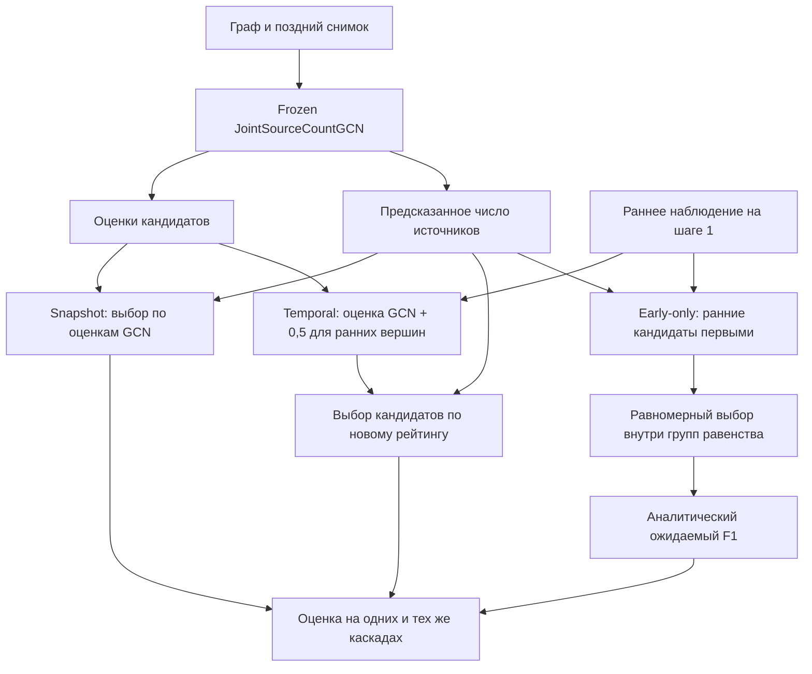
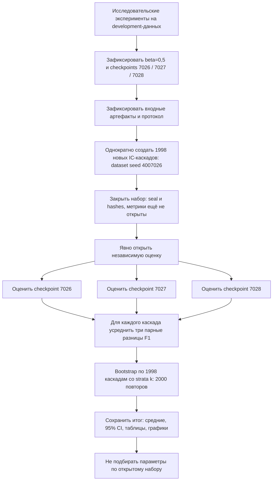

# Схемы для диплома — Mermaid

Код внутри блоков можно перенести в Mermaid-редактор и экспортировать в SVG либо PNG. В Word вставляется экспортированное изображение, а не исходный Mermaid-код. Подписи и пояснения ниже написаны обычным текстом. Номера рисунков назначаются в итоговом дипломе.

## Схема 1. Сравниваемые методы

Подпись: «Сравнение Snapshot, Temporal и контроля Early-only при общей оценке числа источников».

Пояснение: три ветви различаются способом выбора вершин. Snapshot использует обученные оценки; Temporal добавляет информацию раннего наблюдения; Early-only не использует оценки GCN для ранжирования. Все ветви используют число источников из одной count-head. Поэтому изменение качества Temporal связано с ранжированием, а не с изменением количества. Early-only оценивается через ожидаемый F1; его конкретные геометрические предсказания не показаны. Схема изображает применение frozen модели, а не обучение новой временной архитектуры.

## Схема 2. Независимая проверка результата

Подпись: «Порядок независимой оценки временной поправки без повторной настройки параметров».

Пояснение: фиксация параметров предшествует открытию независимых результатов. Три checkpoints оценивают один набор, поэтому оценки одного каскада зависимы; перед bootstrap они усредняются. CI показывает неопределённость разницы качества на новых каскадах данного графа и протокола. Схема не означает перенос на другой граф. После открытия набор не превращается в данные для настройки следующей версии модели.
